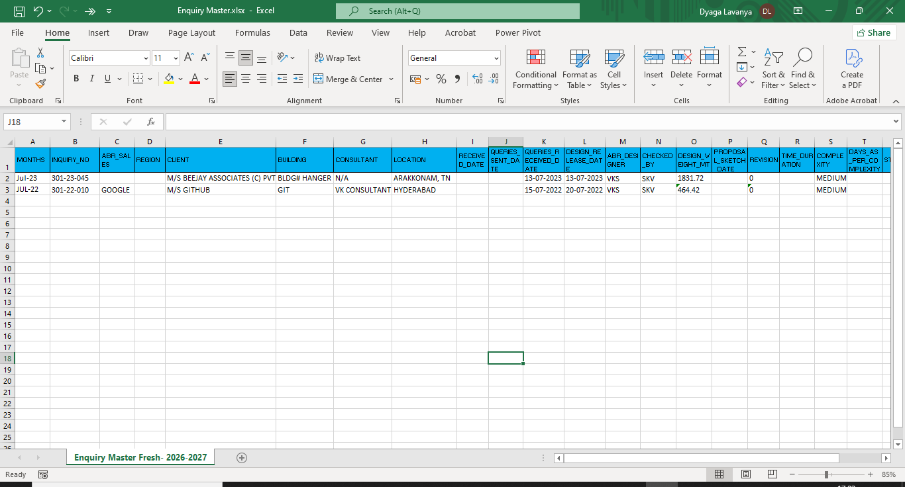

# Quote PDF Automation

A Python utility that downloads new EES quotation PDFs from Gmail, extracts key project details, and appends them to an Excel enquiry master. After a PDF is processed successfully, it is renamed with its RFQ number and moved to the processed folder.

## Features

- Connects to Gmail with the Google Gmail API using read-only OAuth access.
- Downloads PDF attachments whose filenames contain `ees` from messages in the configured Gmail label.
- Extracts enquiry details such as RFQ number, customer, location, consultant, dates, sales engineer, designer, reviewer, revision, complexity, and design weight.
- Cleans text and normalizes supported dates before saving the data.
- Adds each processed PDF as a new row in the configured Excel worksheet.
- Organizes completed source files by renaming and moving them to `Processed PDFs`.
- Processes every `.pdf` file in `New PDFs`, including files downloaded from Gmail and files added manually.

## Requirements

- Python 3.10 or later
- Microsoft Excel workbook at the configured output location
- PDF files with selectable text (image-only/scanned PDFs require OCR before they can be extracted reliably)
- A Google Cloud OAuth desktop-client credential with the Gmail API enabled

Core PDF and Excel packages are pinned in [requirements.txt](requirements.txt):

- `pdfplumber` for PDF text extraction
- `openpyxl` for updating the Excel workbook

Gmail also requires `google-auth`, `google-auth-oauthlib`, and `google-api-python-client` for authentication and downloads.

## Folder Structure

The application is configured to use the following layout:

```text
Quotes PDFs/
+-- Excel/
|   `-- Enquiry Master.xlsx
+-- New PDFs/                    # Place unprocessed quote PDFs here
+-- Processed PDFs/              # Processed PDFs are moved here
`-- Python Automation/
    +-- main.py                  # Application entry point
    +-- config.py                # Folder, workbook, and worksheet settings
    +-- pdf_reader.py            # PDF extraction rules
    +-- cleaner.py               # Text and date cleanup helpers
    +-- excel_writer.py          # Excel row writer
    +-- gmail_auth.py            # Gmail OAuth authentication and token refresh
    +-- gmail_downloader.py      # Downloads matching PDF attachments from Gmail
    +-- mappings.py              # Data-field to Excel-column mapping
    +-- utils.py                 # Shared extraction and file-move helpers
    +-- requirements.txt
    `-- README.md
```

## Installation

1. Clone or download this project into the `Quotes PDFs/Python Automation` folder.

2. Create and activate a virtual environment:

   ```powershell
   python -m venv venv
   .\venv\Scripts\Activate.ps1
   ```

3. Install the dependencies:

   ```powershell
   pip install -r requirements.txt
   pip install google-auth google-auth-oauthlib google-api-python-client
   ```

4. Create the folders shown above if they do not already exist.

5. Place `Enquiry Master.xlsx` in the `Excel` folder. Ensure it contains the worksheet specified by `SHEET_NAME` in [config.py](config.py).

6. Review [config.py](config.py) and update `ROOT_FOLDER`, `EXCEL_FILE`, or `SHEET_NAME` if your folders or workbook use different names.

7. Configure Gmail access:

   1. In Google Cloud, enable the Gmail API and create an OAuth 2.0 **Desktop app** client.
   2. Download the client credential JSON and save it as `credentials.json` in the `Python Automation` folder.
   3. Set `LABEL_ID` in [gmail_downloader.py](gmail_downloader.py) to the Gmail label that contains quotation emails.
   4. On the first run, complete the browser sign-in and consent prompt. The application saves the resulting access and refresh token as `token.json` for future runs.

   `credentials.json` and `token.json` grant access to the configured Gmail account. Keep them private and do not commit or share them.

## Usage

1. Add quotation emails to the configured Gmail label. You can also copy PDFs into `New PDFs` for manual processing.

2. Run the application from the `Python Automation` folder:

   ```powershell
   python main.py
   ```

3. The application will:

   1. Authenticate with Gmail and retrieve messages in the configured label.
   2. Download attachments only when the filename is a PDF and contains `ees` (case-insensitive), saving them to `New PDFs`.
   3. Extract and clean the configured fields from every PDF in `New PDFs`.
   4. Append the values to the next available row of the Excel worksheet.
   5. Rename the source PDF to `<RFQ_NUMBER>.pdf`.
   6. Move it to `Processed PDFs`.

4. Open `Excel/Enquiry Master.xlsx` to review the newly added rows.

Example console output:

```text
Downloading New EES PDFs from Gmail...
Found 2 email(s).
Downloaded : EES-quotation.pdf

Processing : EES-quotation.pdf
Excel Path: E:\Quotes PDFs\Excel\Enquiry Master.xlsx
[OK] Saved to Row 25
[OK] PDF moved.

Automation Completed Successfully.
```

## Excel Mapping

The workbook columns are controlled in [mappings.py](mappings.py). The primary fields include:

| Excel column | Field |
| --- | --- |
| A | Month |
| B | Inquiry / RFQ number |
| C | ABR sales engineer |
| E | Client |
| F | Building |
| G | Consultant |
| H | Location |
| K-N | Key dates, designer, and checker |
| O-V | Weight, revision, complexity, status, and remarks |

## Screenshots

1. **Input folder** - PDFs placed in `New PDFs` before processing.
2. **Terminal output** - a successful `python main.py` run.
3. **Excel result** - the new row in `Enquiry Master.xlsx`.
4. **Processed folder** - the renamed PDF after completion.

Once image files are added to the repository (for example, under `docs/screenshots/`), reference them here:

```1. **Input folder** - PDFs placed in `New PDFs` before processing.


2. **Terminal output** - a successful `python main.py` run.


3. **Excel result** - the new row in `Enquiry Master.xlsx`.


4. **Processed folder** - the renamed PDF after completion.

```

## Configuration Notes

- Gmail settings are in [gmail_downloader.py](gmail_downloader.py). `LABEL_ID` identifies the source label, and `DOWNLOAD_FOLDER` is the folder used for downloaded attachments.
- Gmail access is read-only. The application does not mark messages as read, remove labels, or otherwise change email messages.
- The downloader currently retrieves attachments from all messages returned for the configured label. It does not track previously downloaded emails, so keep the label limited to new quotation emails or remove/archive messages from the label after successful processing to avoid duplicates on later runs.
- Extraction patterns live in [pdf_reader.py](pdf_reader.py). Adjust them when a PDF template uses different labels or formatting.
- `ABR_SALES` is extracted from the text following `SALES ENGG.`. For multi-line PDF layouts, use a line-based pattern such as `r"SALES ENGG\.\s*([^\r\n]+)"`.
- The script appends to `sheet.max_row + 1`; keep the target worksheet available and avoid protected workbooks.
- Processed PDFs are renamed using the extracted RFQ number. Verify that each source PDF contains a valid RFQ number before running the script.

## Troubleshooting

| Issue | Suggested check |
| --- | --- |
| `No new PDFs found.` | Add matching Gmail attachments to the configured label or add PDF files directly to `New PDFs`. |
| Gmail sign-in opens on every run | Delete an invalid `token.json`, then run the script and complete the OAuth prompt again. |
| Gmail authentication fails | Confirm the Gmail API is enabled, `credentials.json` is a Desktop app credential, and the signed-in account has access to the configured label. |
| No Gmail attachments are downloaded | Confirm the email is in the configured label and the attachment filename is a PDF containing `ees`. |
| Workbook or worksheet error | Confirm the Excel file path and sheet name in `config.py`. |
| A field is blank in Excel | Inspect the extracted PDF text and update the matching pattern in `pdf_reader.py`. |
| PDF cannot be read | Confirm it is a valid, text-based PDF; scanned PDFs may require OCR. |

## License

This project is intended for internal use. Add a license file if it will be shared externally.
